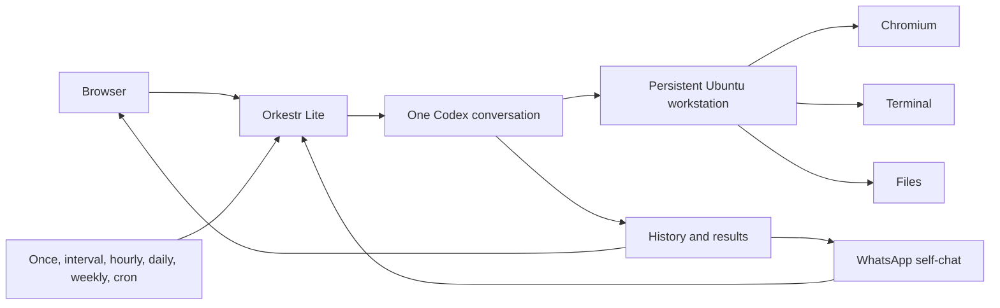
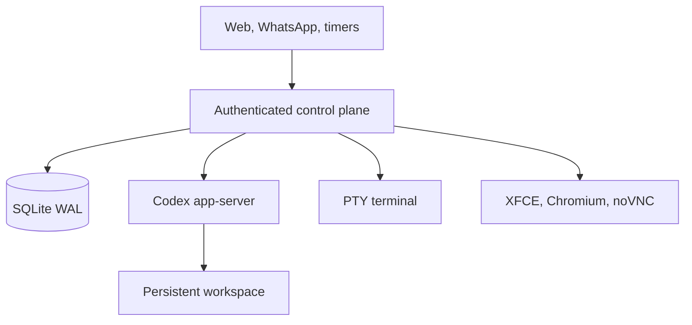

# Orkestr Lite

> **An always-on Codex workstation you can reach from the browser or WhatsApp.**

[](https://github.com/otcan/orkestr-lite/actions/workflows/ci.yml)
[](LICENSE)

[](https://openai.devpost.com/)

Codex can do serious agentic work. The unreliable part is everything around it:
keeping a machine available, running work on a schedule, preserving browser
state, connecting messaging, recovering after disconnects, and bringing the
human back when judgment is needed.

**Orkestr Lite packages that operational layer into one self-hosted Docker
application.**

Send work manually, from your own WhatsApp chat, or on a timer. Codex handles it
inside a persistent Ubuntu workstation. Watch the desktop live, take control
when needed, and come back to the same conversation, browser, files, terminal,
and results.

**Codex does the work. Orkestr keeps the workstation running.**

## One workstation, one continuous conversation

Orkestr Lite deliberately avoids project hierarchies and orchestration graphs.
It gives one user one continuous Codex conversation attached to one persistent
workspace.



Every input enters the same durable FIFO queue and reaches the same context.
Work started from WhatsApp is visible in the browser. Scheduled work joins the
conversation instead of disappearing into a separate automation log. Closing
the browser does not close the workstation.

## What you can do

### Start work from the web or WhatsApp

Use the web chat, or link WhatsApp as a companion device by scanning a QR code.
Messages sent to your own WhatsApp chat enter Orkestr, and results return to
that chat. Five-second batching, media in both directions, and a durable
at-least-once outbox keep messaging useful through reconnects.

### Run work now or later

Create one-time, interval, hourly, daily, weekly, or standard five-field cron
timers. Schedules have timezone-aware previews, a five-minute minimum, overlap
coalescing, and missed-run accounting. Scheduled messages use the same queue as
manual requests and can be paused, edited, run immediately, or deleted.

### Give Codex a real workstation

The optional **Live Desk** includes Ubuntu 24.04, XFCE, Chromium, tmux, Byobu,
passwordless `sudo`, git, ripgrep, jq, and Codex. Browser data persists between
runs. Watch Codex use the environment, open the Desk full-screen, or explicitly
take control of the keyboard and mouse.

### Work with the same files and terminal

The browser interface exposes a real PTY terminal and a whole-container Files
view. Browse, upload, download, attach, and share files without moving work into
a second tool.

### Recover honestly

Conversation history, queued work, schedules, files, Codex state, and browser
data live in Docker volumes. If execution is interrupted, Orkestr preserves the
evidence, attempts one inspect-before-continuing recovery, and avoids silently
replaying uncertain work.

## What is it useful for?

Orkestr Lite is an operational layer, not a workflow-specific bot. For example:

- **Outreach:** research contacts, prepare follow-ups, and bring drafts back for
  review.
- **Job search:** review opportunities, prepare application material, and
  revisit the pipeline on a schedule.
- **Messaging:** inspect unresolved conversations, prepare replies, and ask for
  a decision when needed.
- **Recurring checks:** inspect a site, repository, queue, or report on a
  schedule and explain what changed.
- **Browser work:** keep an authenticated browser profile available when an API
  is not enough.

These are examples, not built-in LinkedIn or job-board integrations. External
services remain subject to their own authentication, policies, and approval
requirements.

## Product surface

| Surface      | What it does                                                      |
| ------------ | ----------------------------------------------------------------- |
| **Chat**     | Send instructions and follow one continuous Codex conversation.   |
| **Desk**     | Watch the Ubuntu desktop, use Chromium, or take control.          |
| **Files**    | Inspect, upload, download, attach, and share workstation files.   |
| **Terminal** | Work directly inside the same environment through a real PTY.     |
| **Timers**   | Schedule once, interval, hourly, daily, weekly, or cron messages. |
| **Settings** | Connect Codex and WhatsApp and manage the workstation.            |

Diagnostics and raw Codex events remain available when needed, but they are not
the product experience.

## Quickstart

### Requirements

- Linux AMD64, or Docker Desktop with Linux containers
- Docker Engine with Docker Compose v2
- an OpenAI account with Codex access
- 4 GB RAM for headless operation
- 8 GB RAM recommended for Live Desk

### Start the complete workstation

```bash
git clone https://github.com/otcan/orkestr-lite.git
cd orkestr-lite
docker compose --profile desk up --build
```

Open <http://localhost:3000>.

On first boot, Orkestr generates an administrator password and prints it once
in the local container logs:

```bash
docker compose logs orkestr
```

Then:

1. Sign in to Orkestr.
2. Connect Codex with ChatGPT device authentication or an API key.
3. Optionally link WhatsApp by scanning the QR code.
4. Open **Chat** and send the first request.
5. Open **Desk** to watch the workstation or take control.

### Headless mode

If you do not need the graphical desktop:

```bash
docker compose up --build
```

Chat, WhatsApp, timers, files, terminal, persistence, and the Codex workspace
remain available.

Persistent volumes hold the control database, Codex login, workspace, Desk
home/browser state, and private Desk token. A normal restart does not discard
them.

## Try one complete loop

Start manually in Chat:

> Inspect the workspace, explain its current state, and tell me what needs
> attention first.

Then create a timer:

> Every Monday at 09:00, review the workspace and summarize anything that
> requires action.

Or send this to your own linked WhatsApp chat:

> Review the open work and send me the three most important next actions.

All three inputs enter the same conversation. Open **Desk** while Codex is
working to see the environment it is using, then inspect the resulting files
and terminal output directly.

## WhatsApp supervision

Only the linked account's self-chat can submit work or control it. Other direct
chats are retained as a read-only local inbox snapshot for Codex; groups and
status broadcasts are ignored.

Commands must be the entire self-chat message:

```text
status
status CODE
stop CODE
approve CODE
decline CODE
help
```

Every actionable conversation turn gets an eight-character code. Commands are
deduplicated by WhatsApp message ID, audited on the turn, and answered through
the durable outbox. Normal prose, including sentences containing words such as
"status" or "stop," continues to Codex.

## How it works

Orkestr Lite is a modular monolith with an optional desktop runtime:



NestJS owns authentication, queueing, schedules, persistence, recovery, and the
Codex process boundary. Angular provides the browser experience. Codex
app-server runs the conversation and streams structured activity. SQLite stores
operational state without an external database, and `whatsapp-web.js` provides
the linked-device self-chat bridge.

Only loopback port `3000` is published. Codex app-server, the Desk agent, and
VNC remain on the private Compose network. There are no webhooks, hosted
instances, or public automation endpoints.

## Research demo

The v0.2 public story is a real GPT-5.6 research workflow comparing the official
runtime documentation for
[OpenHands](https://docs.openhands.dev/openhands/usage/architecture/runtime),
[Open Interpreter](https://www.openinterpreter.com/docs/terminal/getting-started),
and [goose](https://goose-docs.ai/docs/getting-started/installation/). It writes
cited Markdown and HTML reports, opens the HTML in Desk, accepts a sourced
WhatsApp follow-up with the updated Markdown returned as a file, and runs a
weekly watch through the same conversation.

```bash
export ORKESTR_LIVE_PASSWORD='your local administrator password'
export ORKESTR_DEMO_WORKSPACE="$PWD/.demo/workspace"
export ORKESTR_LIVE_URL=http://127.0.0.1:3001
npm run demo:prepare
npm run demo:up
npm run demo
npm run demo:verify
```

`demo:reset` removes only the v0.2 demo artifacts and refuses to run unless the
target workspace contains the disposable-demo sentinel. See
[JUDGE_GUIDE.md](JUDGE_GUIDE.md) and the [demo runbook](docs/DEMO.md).

## Built for OpenAI Build Week

Orkestr Lite was built with Codex as the primary implementation environment and
is submitted in the **Developer Tools** category.

Codex accelerated the app-server integration, persistent conversation
controller, WhatsApp router, scheduler, terminal, file handling, Live Desk,
Docker packaging, security boundaries, and automated verification. The product
itself runs through Codex app-server, discovers the models available to the
authenticated account, and records both the requested and effective model.

The product decisions remained human-owned: one user, one conversation,
serialized execution, explicit recovery, an optional graphical Desk, and
WhatsApp self-chat instead of a second phone number.

## Development and release gates

```bash
npm ci
npx playwright install chromium
npm run check
npm run test:docker
npm run check:release
```

Docker smoke tests clean up their temporary containers, volumes, and locally
built images on success, failure, `SIGINT`, or `SIGTERM`. If a host interruption
still leaves a stopped test container behind, run:

```bash
npm run docker:cleanup
```

That command removes only stopped Orkestr smoke containers. To remove every
stopped container on the Docker host while preserving running containers,
images, and named volumes, use the deliberately explicit global command:

```bash
npm run docker:cleanup:all
```

The immutable release publishes a paired Linux AMD64 runtime:

- control: `ghcr.io/otcan/orkestr-lite:v0.2.0-build-week`
- Desk: `ghcr.io/otcan/orkestr-lite:v0.2.0-build-week-desk`

The tag workflow builds and attests both images, starts the published digests
together, verifies health, private networking, VNC authentication, tools,
restarts, and persistence, and records both digests plus the source SHA in one
release. `v0.1.0-build-week` remains unchanged.

The automated suite covers the product walkthrough, Codex protocol lifecycle,
persistence and recovery, timers, WhatsApp routing, workspace boundaries,
authentication, production builds, and clean Docker restart.

## Security and current scope

Orkestr Lite is a powerful local application. Access to it is equivalent to
shell access to its workstation.

- Port `3000` binds to loopback by default.
- Both containers start as the unprivileged `orkestr` user, with intentional
  passwordless `sudo` for the single local YOLO operator.
- Codex credentials and WhatsApp session state stay in private persistent
  volumes.
- The Docker socket is never mounted.
- Live Desk is an isolated desktop container, not a virtual machine or hard
  multi-tenant boundary.

System packages installed at runtime survive an ordinary container restart but
not an image upgrade or container recreation; bake permanently required tools
into a custom image. Do not expose Orkestr directly to the public internet.
Read [Security](SECURITY.md) before changing the deployment boundary.

Current limits are intentional: one user, one active Codex conversation, and
one workspace per installation; Linux AMD64 is the verified release target;
WhatsApp uses the user's linked-device session and self-chat; and delivery is
at least once, so a rare duplicate is preferred to silent loss. Orkestr does
not bypass CAPTCHAs, service policies, or authentication requirements.

See the [architecture](docs/ARCHITECTURE.md),
[release operations](docs/RELEASE.md), and [security model](SECURITY.md) for the
full operational boundary.

## License

[Apache-2.0](LICENSE)
