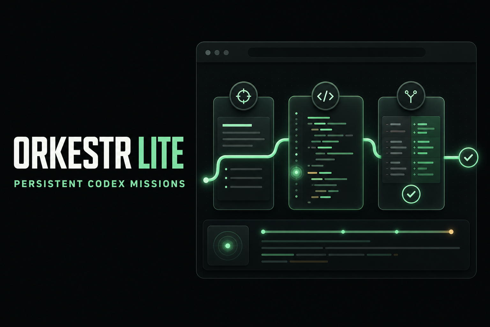
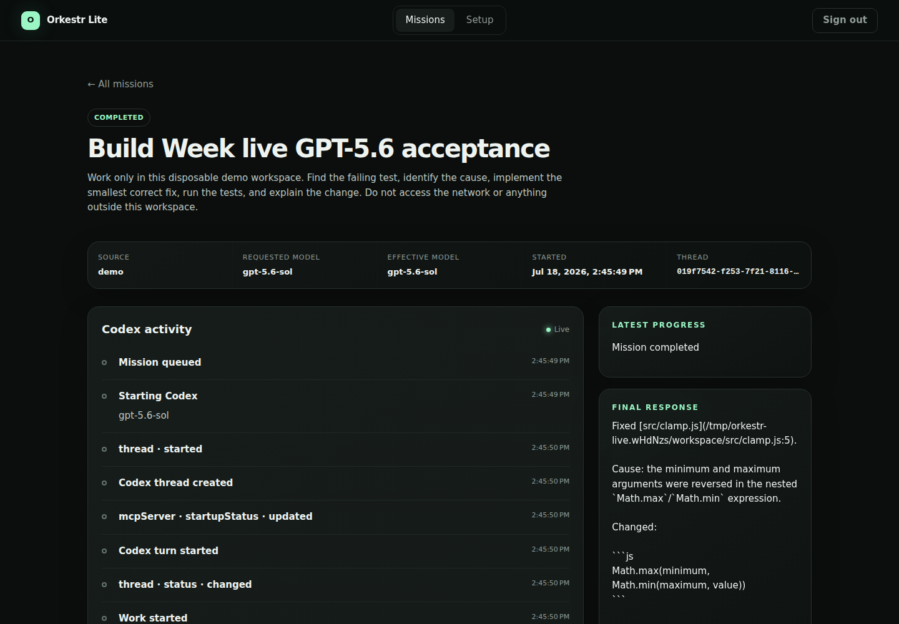
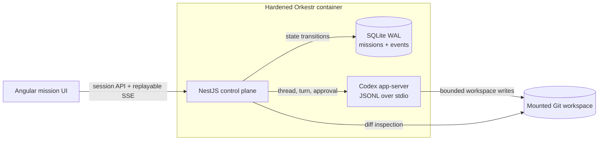

# Orkestr Lite

> Persistent Codex coding missions, with the operational truth left intact.

[](https://github.com/otcan/orkestr-lite/actions/workflows/ci.yml)
[](https://github.com/otcan/orkestr-lite/releases/tag/v0.1.0-build-week)
[](LICENSE)




_Illustrative campaign artwork; an authentic live product capture appears below._

Orkestr Lite is a browser-operated control plane for real Codex work. Give it a bounded repository mission, follow commands, approvals, progress, and diffs live, then return to a durable record even if the Codex process or container restarts.

Built for the **Developer Tools** track of [OpenAI Build Week](https://openai.devpost.com/), it focuses on one hard problem: making agentic coding work observable and recoverable without turning Codex into a generic chat window.

## Try the frozen release without rebuilding

Requirements: Linux AMD64, Docker Engine, Docker Compose v2, and a Codex account with an eligible GPT-5.6 model.

```bash
git clone --branch v0.1.0-build-week --depth 1 https://github.com/otcan/orkestr-lite.git
cd orkestr-lite
export ORKESTR_IMAGE="ghcr.io/otcan/orkestr-lite@sha256:026beb20c20f92b226424ffa32316b7a9b0fe2fb26461aae0d95df3960657e9b"
docker compose pull orkestr
docker compose up -d --no-build
docker compose logs orkestr
```

Open <http://localhost:3000>, sign in with the generated administrator password shown once in the logs, and authenticate Codex. Application state and the seeded Git workspace persist in Docker volumes.

The image is an immutable, public Linux AMD64 build with GitHub artifact attestation. Its health, authentication, unprivileged runtime, restart behavior, and persisted data were smoke-tested at the published digest. See the [release contract](docs/RELEASE.md) for verification and the source-build fallback.

## See the complete loop

The seeded workspace starts with one intentionally failing test. Create a mission with:

> Find the failing test in this workspace, implement the smallest correct fix, run the tests, and explain the change. Do not modify dependencies or files unrelated to the failure.

Then watch Orkestr Lite preserve the queue transition, selected and effective model, Codex activity, workspace diff, test output, and final response. Verify the result independently:

```bash
docker compose exec orkestr git -C /workspace diff
docker compose exec orkestr node --test /workspace/test/clamp.test.js
```



_Sanitized capture from the live authenticated GPT-5.6 acceptance mission. No account or credential data is shown._

The exact bounded walkthrough and sub-three-minute narration are in the [judge and demo runbook](docs/DEMO.md).

## Why this is more than a chat wrapper

| Agent-work problem                                           | Orkestr Lite's answer                                                                    |
| ------------------------------------------------------------ | ---------------------------------------------------------------------------------------- |
| A prompt is not an operational record                        | Missions have persisted status, thread, turn, events, result, and workspace diff         |
| Concurrent agents can collide in one repository              | One active mission serializes workspace mutation; later work remains queued              |
| Approval requests can disappear during reconnects            | Events replay from a durable cursor before the browser attaches to the live stream       |
| A process can die after changing files but before responding | In-flight work becomes explicitly interrupted; uncertain work is never silently replayed |
| Requested and actual models can differ                       | Every mission records requested, effective, and rerouted model identifiers               |
| Browser access expands the trust boundary                    | Codex credentials and app-server stay behind the API in a hardened local container       |

The intentionally narrow contract—one user, one container, one workspace, one active mission—makes the safety and recovery semantics concrete enough to test rather than merely describe.

## Architecture



NestJS owns mission ordering, recovery policy, sessions, and the Codex process boundary. Angular renders mission state instead of inventing it. SQLite in WAL mode stores the durable mission/event log. A typed client speaks the pinned Codex app-server protocol over standard input/output.

Read [Architecture](docs/ARCHITECTURE.md) for the state machine, recovery semantics, trust boundaries, model provenance, and test strategy.

## Codex and GPT-5.6 evidence

Codex was the primary implementation environment for the repository: it accelerated the empty baseline into the app-server client, mission controller, Angular product, security boundaries, deterministic fixture, browser acceptance, Docker gate, and submission package. The entrant kept the high-impact decisions explicit, including the modular monolith, serialized workspace writes, backend-owned Codex process, and inspect-before-continue recovery.

GPT-5.6 is also part of the running product. Orkestr Lite discovers available models through Codex app-server, selects an eligible GPT-5.6 model, and persists both the requested and effective identifiers. The live acceptance mission used `gpt-5.6-sol`, fixed the bounded demo bug, and independently finished with all three tests passing.

- Primary Codex implementation `/feedback` session: `019f745b-ee85-7533-b151-e25c7baff729`
- Live acceptance mission: `8f23b759-7741-4c19-a1c8-b7936de567e3`
- Requested/effective live model: `gpt-5.6-sol` / `gpt-5.6-sol`
- Full sanitized provenance: [Build Week evidence](docs/competition/BUILD_WEEK.md)

The protocol-faithful fake Codex process is deterministic regression infrastructure. It is not presented as live GPT-5.6 evidence.

## Proof, not promises

| Gate                       | What it proves                                                                                                                |
| -------------------------- | ----------------------------------------------------------------------------------------------------------------------------- |
| `npm run test`             | SQLite WAL behavior and typed Codex-client lifecycle                                                                          |
| `npm run test:integration` | Mission execution, crash recovery, full event replay, model provenance, and security boundaries                               |
| `npm run test:browser`     | Compiled product flow in real Chromium: login, setup, mission, live activity, deep-link reload, result, logout                |
| `npm run audit`            | Production and development dependency audits                                                                                  |
| `npm run test:docker`      | Health, authentication, restart, persistence, filesystem modes, unprivileged user, zero capabilities, and `no-new-privileges` |
| `npm run check:release`    | Formatting, production builds, type checks, all application tests, browser acceptance, audits, and Compose validation         |

GitHub Actions runs the release gate and a clean isolated Docker smoke test on every pull request to `main`.

## Repository map

```text
apps/
  server/              NestJS API, authentication, missions, persistence, Codex lifecycle
  web/                 Angular mission and setup experience
packages/
  codex-client/        Typed JSONL client for the Codex app-server protocol
  shared/              Cross-workspace mission and event contracts
demo/
  workspace/           Deterministic failing-test workspace for the judge path
  *.mjs                Reset and live acceptance automation
test/
  e2e/                 Real-browser product walkthrough
  integration/         Mission, recovery, replay, provenance, and security coverage
  smoke/               Isolated production-container verification
docs/
  ARCHITECTURE.md       State machine, trust boundaries, decisions, and test layers
  DEMO.md               Exact judge path and sub-three-minute demo
  RELEASE.md            Immutable source/image release contract
  competition/          Provenance, submission copy, media, and final checklist
assets/submission/      Authentic product captures and disclosed campaign artwork
```

The source remains a small npm-workspace monorepo. Product code is separated by runtime boundary; competition operations are separated from product documentation.

## Develop from source

Requirements: Node.js 22, npm 10, Git, Docker for the container gate, and Codex CLI `0.144.5` for a live run.

```bash
npm ci
npx playwright install chromium
npm run check:release
npm run test:docker
```

For local development:

```bash
npm run dev:server
npm run dev:web
```

Reset the disposable seeded workspace with `node demo/reset-demo.mjs`. Do not use its destructive reset behavior against a real project.

## Scope and safety

The competition build is single-user, loopback-only by default, and targets Linux AMD64. It requires the user's own eligible Codex authentication and is not a hosted multi-tenant service. Workspace inspection, multiple workspaces, a PTY terminal, timers, and WhatsApp routing are later milestones.

Treat access to Orkestr Lite as equivalent to shell access to its mounted workspace. Never expose port 3000 directly to the public internet; read [Security](SECURITY.md) before changing the deployment boundary.

## Documentation

- [Documentation index](docs/README.md)
- [Architecture and engineering decisions](docs/ARCHITECTURE.md)
- [Judge and demo runbook](docs/DEMO.md)
- [Release contract](docs/RELEASE.md)
- [Build Week provenance](docs/competition/BUILD_WEEK.md)
- [Submission checklist](docs/competition/CHECKLIST.md)
- [Devpost narrative](docs/competition/SUBMISSION.md)
- [Media package](docs/competition/MEDIA.md)

The immutable `v0.1.0-build-week` tag and published image remain the competition runtime. Documentation on `main` may record later evidence and presentation improvements but does not silently amend that frozen artifact.

## License

[Apache-2.0](LICENSE)
