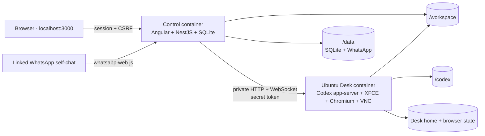

# Architecture

Orkestr Lite is a local, single-user operational runtime around Codex. The
visible product has one conversation and one persistent workstation; internal
turn identifiers are implementation details used for ordering, attribution,
recovery, and WhatsApp controls.

Only control port 3000 is published, bound to `127.0.0.1`. Desk health, its
control agent, VNC, and app-server traffic remain on the private Compose
network. The control container authenticates Desk calls with a token stored in
a shared private volume; browser VNC connections use one-use, short-lived
tickets in addition to the Orkestr session and same-origin check.

## Control plane

NestJS owns browser authentication/CSRF, SQLite migrations, the durable FIFO,
Codex connection recovery, context telemetry, schedules, attachment validation,
WhatsApp batching/outbox, and server-sent browser events. Angular renders that
durable state. It never receives Codex credentials and does not invent status
optimistically.

SQLite uses WAL mode. It stores conversation turns, their exact Codex IDs,
events, enqueue sequence, timers and run history, WhatsApp callback claims/open
batches/outbox/inbox, attachment metadata, control codes, settings, and global
conversation telemetry. Older pages use stable enqueue cursors; durable turn
URLs remain readable through the local API even though the UI redirects
`/chat/:id` to the single `/chat` surface.

## Work ordering and recovery

Browser, WhatsApp, scheduled, and manual Run-now inputs reserve one enqueue
sequence and remain FIFO. At most 250 open/pending turns and WhatsApp batches
are accepted. The server can retain queued input while an already-configured
Codex runtime reconnects.

Only one turn is active. A user stop is terminal. An infrastructure interruption
gets one inspect-before-continuing recovery attempt; a second failure remains
visible. Codex events are attributed by exact Codex turn ID. Connection,
token-usage, compaction, and MCP events go to a separate conversation stream so
they cannot accidentally complete the newest turn.

Codex retains its built-in automatic context compaction. Orkestr records
last-context token usage, warnings at 80/90 percent, compaction count/time, and
offers manual compaction while idle. A context-window failure is compacted and
requeued once with recovery metadata.

Clearing context keeps the workspace intact and, by default, leaves the visible
conversation as a read-only reference. The confirmation can also start with an
empty Codex UI; this hides the old turns from the current conversation without
deleting their durable audit records. Orkestr starts a replacement Codex context
first, then atomically switches the active context, archives the previous
internal ID, resets context telemetry, and records the boundary. If replacement
creation fails, the previous context remains active.

## Schedules

Schedules support once, interval, hourly, daily, weekly, and standard five-field
cron forms with an IANA timezone. Validation and dispatch both enforce a
five-minute minimum. Preview uses the same backend evaluator and returns the
next three occurrences.

If a timer already owns queued or active work, an occurrence is recorded as
`skipped` with reason `overlap`. Run now returns HTTP 409 for the same condition.
After downtime, one stale occurrence is recorded as `missed`; the timer advances
directly to its next future run and never backfills a burst.

## WhatsApp boundary

The linked account’s self-chat is the only WhatsApp write/control surface.
Other direct chats are read-only inbox data; groups and status broadcasts are
ignored. Exact commands are parsed before the five-second batch path. Per-turn
codes are eight case-insensitive characters and collision-safe in SQLite.
Callback message IDs deduplicate both messages and actions.

Inbound media is decoded and size-checked before an atomic write under
`/data/attachments/whatsapp/incoming`; names are sanitized, hashes recorded,
and unpinned bytes expire after 30 days. Outbound paths must resolve to regular
files inside `/workspace` or the attachment store, may not escape through a
symlink, and are capped at 25 MB. The durable outbox retries until WhatsApp
acknowledges or the operator discards an item. Delivery is at least once.

## Files, terminal, and Desk

Files can browse the whole container but downloads/uploads remain validated.
The explicit “Send to WhatsApp” action is allowed only for regular files in the
workspace or attachment store. Terminal is a real PTY backed by xterm. Desk is
directly interactive through authenticated VNC and persists its home directory,
including Chromium state, separately from the workspace and Codex home.
Both Ubuntu containers start as UID 1000 and include tmux, Byobu, and
passwordless `sudo`. This deliberately allows the single local operator and
Codex to administer the isolated workstation. APT changes live in the current
container writable layer: they survive restart, but permanent additions belong
in a derived image because recreation replaces that layer.
Desk startup preserves that profile but removes Chromium's three singleton
links only when no matching profile process exists, the recorded owner is dead
or belongs to an older container, and the referenced Unix socket has no live
listener. `xdg-open`, XFCE, and Codex all route URLs and local HTML files through
the same `/usr/bin/chromium` profile manager.

## Deliberate non-features

There is no webhook ingress, bearer-token automation system, public API
documentation, public port for Desk/VNC/app-server, hosted instance, multi-user
tenant model, or parallel workspace mutation. Existing HTTP endpoints serve the
authenticated local browser and local tooling only.
