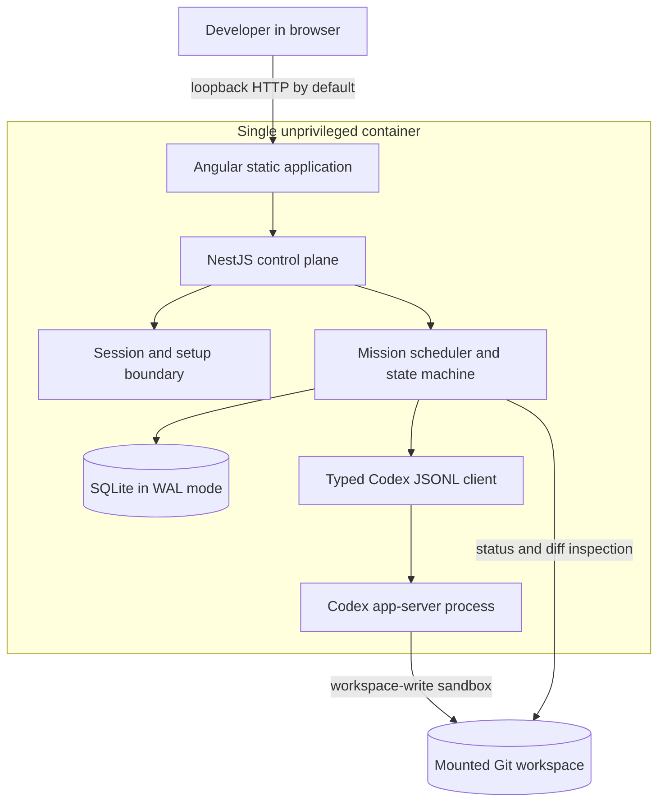
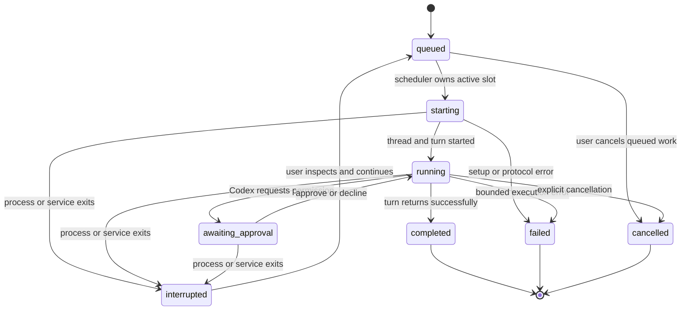

# Architecture

Orkestr Lite is a deliberately narrow control plane for persistent Codex coding missions: one user, one container, one mounted Git workspace, and one active mission. That constraint is the mechanism that makes ordering, recovery, and trust boundaries precise and testable.

## Runtime boundaries

The browser never talks to Codex directly. NestJS owns authentication, model discovery, process lifecycle, mission ordering, approval responses, event persistence, and recovery policy. This keeps Codex credentials and evolving protocol details out of the browser.

## Module map

| Area                    | Location                    | Responsibility                                                                       |
| ----------------------- | --------------------------- | ------------------------------------------------------------------------------------ |
| Web experience          | `apps/web/src/app`          | Setup, mission list/create/detail, approvals, live activity, results, and deep links |
| HTTP control plane      | `apps/server/src`           | Sessions, CSRF, setup, mission APIs, SSE, persistence, and process ownership         |
| Codex boundary          | `packages/codex-client/src` | Typed request/response/notification correlation over JSONL stdio                     |
| Shared contracts        | `packages/shared/src`       | Mission states, models, events, and API-safe data shapes                             |
| Deterministic workspace | `demo/workspace`            | One bounded defect with an independently runnable test suite                         |
| Acceptance layers       | `test`                      | Integration, browser, security, recovery, replay, and production-container gates     |

## Mission state machine

Only one mission can own the active slot. Queue ordering is persisted rather than held only in process memory. A terminal mission frees the slot and the scheduler advances the next queued mission.

## Recovery semantics

Process death is ambiguous: Codex may have changed a file or executed a command immediately before the control plane lost the response. Orkestr Lite therefore does not automatically replay an in-flight turn.

When Codex app-server exits:

1. the active mission is marked `interrupted` exactly once;
2. the previous status and exit metadata are appended to the durable event stream;
3. the active slot is released so unrelated queued work can continue after readiness returns;
4. the app-server is restarted and model/account readiness is refreshed; and
5. the interrupted mission remains available for an explicit inspect-then-continue action.

This policy prefers an honest uncertain state over an attractive duplicate mutation.

## Persistence and event delivery

SQLite stores mission identity, prompt, queue position, status, Codex thread/turn IDs, requested and effective models, recovery metadata, final response, and structured events. WAL mode supports the append-heavy mission stream while the API serves reads.

The mission detail stream uses a cursor:

1. replay persisted event batches until the cursor reaches the current end;
2. attach the live subscription without resetting the cursor; and
3. coalesce browser refreshes while a large replay is arriving.

This ordering keeps approval requests actionable even when they fall beyond a single replay page and avoids a replay/live handoff gap.

## Model provenance

The requested model is intent; the effective model is runtime truth. Orkestr Lite records both.

- Setup discovers models through Codex app-server rather than assuming an identifier.
- Thread start or resume can return an effective model different from the request.
- A later `model/rerouted` notification updates effective provenance without rewriting requested intent.
- The mission UI exposes both values for audit and demo evidence.

## Trust and security boundaries

- The Compose port binds to loopback by default.
- The container runs as the unprivileged `orkestr` user, drops all Linux capabilities, and enables `no-new-privileges`.
- The Codex process and credentials remain server-side under private data modes.
- Administrator passwords are long, generated on first boot when absent, and never placed in the image.
- Browser mutations require an authenticated session and CSRF protection; sign-out revokes all sessions for the single-user instance.
- The workspace mount is the only intended mutation surface. The Docker socket and broad host paths must never be mounted.
- Mission prompts, command output, diffs, and results are sensitive persisted data.

See [Security](../SECURITY.md) for the deployment contract.

## Verification strategy

| Layer                | Representative assertions                                                                                                                             |
| -------------------- | ----------------------------------------------------------------------------------------------------------------------------------------------------- |
| Unit                 | JSONL request correlation, notifications, disconnects, SQLite WAL and replay behavior                                                                 |
| Integration          | Full mission loop, crash-and-restart queue recovery, replay beyond 2,000 events, effective-model and reroute provenance                               |
| Security integration | Authentication rate limits, CSRF, session revocation, headers, private file modes, and API boundaries                                                 |
| Browser              | Login, setup readiness, mission creation, live activity, completion, deep-link reload, diff/result, and logout in Chromium                            |
| Container smoke      | Clean build/start, health, authentication, restart, persisted database/workspace, user, capabilities, `no-new-privileges`, and filesystem permissions |
| Supply chain         | Dependency audits, commit-pinned release actions, immutable image digest, and GitHub artifact attestation                                             |

The release gate is intentionally vertical: a green unit suite cannot mask a broken browser route or an unsafe production container.

## Deliberate tradeoffs

- **Modular monolith over microservices:** one runtime is easier for judges to start and keeps transactional mission ownership local.
- **Serialized writes over maximum throughput:** correctness in one mounted repository matters more than parallel agent count.
- **Server-sent events over a bidirectional socket:** mission activity is primarily server-to-browser; approvals remain ordinary authenticated commands.
- **SQLite over an external database:** the single-user contract gains durable transactions and replay without a second service.
- **Pinned Codex CLI over floating compatibility:** app-server is evolving, so the protocol boundary and fixture are versioned and tested.
- **Explicit interruption over automatic retry:** uncertain side effects must remain visible to the operator.

## Release boundary

The `v0.1.0-build-week` source tag and its paired image digest are immutable. Documentation on `main` can improve discoverability or record later evidence, but any runtime amendment requires a new tag, digest, smoke run, and release record. See the [release contract](RELEASE.md).
